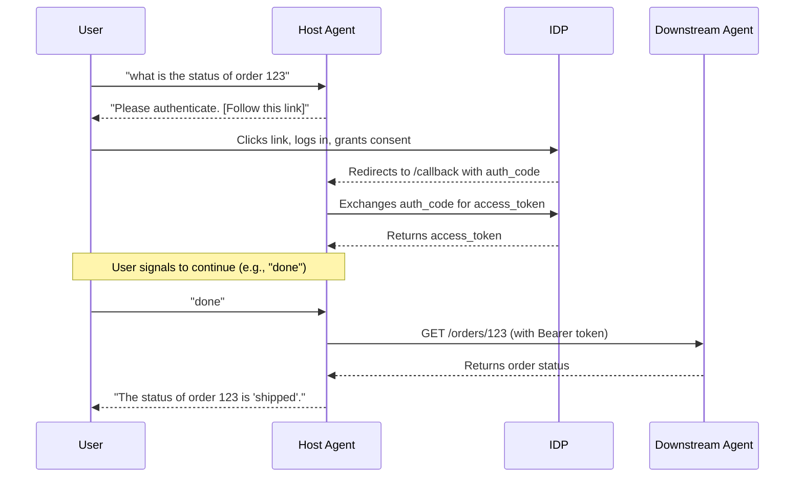

# Multi-Agent Airbnb Planner

(No changes to intro sections)

## Current Status

This project is a functional proof-of-concept demonstrating a secure, multi-tenant agent architecture.

-   **Primary Goal**: The end-to-end security flow is **working**. A user can successfully authenticate via OAuth 2.0 to access a secure, tenant-specific agent.
-   **Task Lifecycle**: The system now uses the A2A Task Lifecycle for seamless, stateful operations.

## Architecture

The architecture consists of a central **Host Agent** that acts as an orchestrator and several downstream agents that perform specific tasks.

-   **Host Agent**: The single entry point for users. It uses a Gemini model to understand user prompts and route them to the appropriate downstream agent. It also manages the security flow and persists session and task state to a local SQLite database.
-   **Downstream Agents**:
    -   `airbnb_agent`: Searches for accommodations.
    -   `calendar_agent`: Checks the user's Google Calendar.
    -   `weather_agent`: Provides weather forecasts.
    -   `horizon_agent`: A sample tenant-specific agent for retrieving order status. This agent is secure and requires an OAuth 2.0 token.
-   **Auth Lib**: A shared library for JWT validation, used by all secure downstream agents.
-   **IDP (Identity Provider)**: A mock OAuth 2.0 server that issues JWTs.
-   **Agent Registry**: A simple service that allows the Host Agent to discover available downstream agents.

## State Persistence

The `host_agent` uses a `PersistentTaskStore` backed by a local SQLite database (`host_agent.db`) to maintain the state of all user interactions.

-   **Task Lifecycle Management**: When the `host_agent` delegates a task to a downstream agent, it first creates a record in its own database. It then updates this record with the `remote_task_id` provided by the downstream agent, effectively linking the parent and child tasks.
-   **Session Management**: The system also persists session data, including OAuth tokens, to the database. This ensures that if the `host_agent` is restarted, it can resume interactions without requiring the user to re-authenticate.

## Getting Started

(No changes to this section)

## Security Architecture

The security of the system is based on the OAuth 2.0 Authorization Code Grant flow. This ensures that a user's credentials are never exposed to the agents and that access to secure downstream agents is strictly controlled by short-lived access tokens.



### How it Works
### Step 1: Configure the Identity Provider (IDP)

In a terminal, navigate to the `idp` directory and generate the necessary keys.

```bash
(cd idp && python generate_jwks.py)
```
This will create a `private_key.pem` file for signing tokens and a `jwks.json` file for the public key within the `idp` directory.

### Step 2: Start the Services

To run the demo, you must start the mock IDP, the agent registry, and all agents in separate terminals. **Run each of these commands from the project root directory.**

**Terminal 1: Start the IDP**
```bash
python -m idp.app
```

**Terminal 2: Start the Agent Registry**
```bash
python -m demo_agent_registry.app
```

**Terminal 3: Start the Weather Agent**
```bash
python -m weather_agent
```
...
**Terminal 7: Start the Host Agent**
```bash
# For tenant 'tenant-abc'
python -m host_agent --port 8083 --tenant-id tenant-abc
```

## Interacting with the System

1.  Open a browser and navigate to the `host_agent`'s Gradio UI at **http://localhost:8083**.
2.  To test the secure flow, enter a prompt for the Horizon agent, for example:
    `what is the status of order 123`
3.  You will be presented with a link to authenticate. Click the link.
4.  Log in to the mock IDP with username `john.doe` and password `password123`.
5.  Grant consent. You will be redirected back to the Gradio UI.
6.  After authenticating, signal the agent to continue by sending a message like "done" or re-submitting your original request. The agent will then use its stored credentials to complete the task.

## Key Development Learnings

This project revealed several critical, non-obvious details about the A2A protocol and the ADK framework:

1.  **A2A Task Delegation Lifecycle**: To correctly create a task on a remote agent, the client **MUST** send a `SendMessageRequest` *without* a `taskId`. The remote agent is responsible for creating the task and returning a `Task` object containing the new `remote_task_id`. The client must then capture this ID and associate it with its own local task record to maintain a link between the parent and child tasks.

2.  **A2AClient Authentication**: The `a2a.client.A2AClient` does not handle auth tokens directly on a per-request basis. To make an authenticated call, a new, temporary `httpx.AsyncClient` must be created with the `Authorization` token in its `headers`. This temporary client is then used to create a new, single-use `A2AClient` for the authenticated request.

3.  **Accessing Request Headers**: The A2A server framework does not expose request headers in the most intuitive location. They are not in `context.headers` or `context.call_context.headers`. Instead, they are located within the `ServerCallContext` object at `context.call_context.state['headers']`, and all header keys are lowercased (e.g., `authorization`).